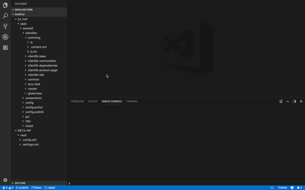

## Overview

Extension that uses the AEM FileVault tool to interact with a CRX repository.

## Configuration

vsvault.vaultLocation - Local file path to the bin folder of the file vault tool

vsvault.host - AEM server host, defaults to localhost

vsvault.port - AEM server port, defaults to 4502

vsvault.credentials - AEM credentials formatted as {user}:{password}, defaults to admin:admin

## Features

Run File Vault commands from specific folders, prints the output from the commands in the debug console and displays a message when they are done.

### Vault Push

Vault import command to push local changes to a remote repository. Left click on the folder with the changes and select the Vault Push command.

### Vault Pull

Vault export command to pull repository content to your local files. Left click on the folder that you want to pull content to and select the Vault Pull command.

## Release Notes

### 1.0.0

Vault Pull & Push Vault Commands
